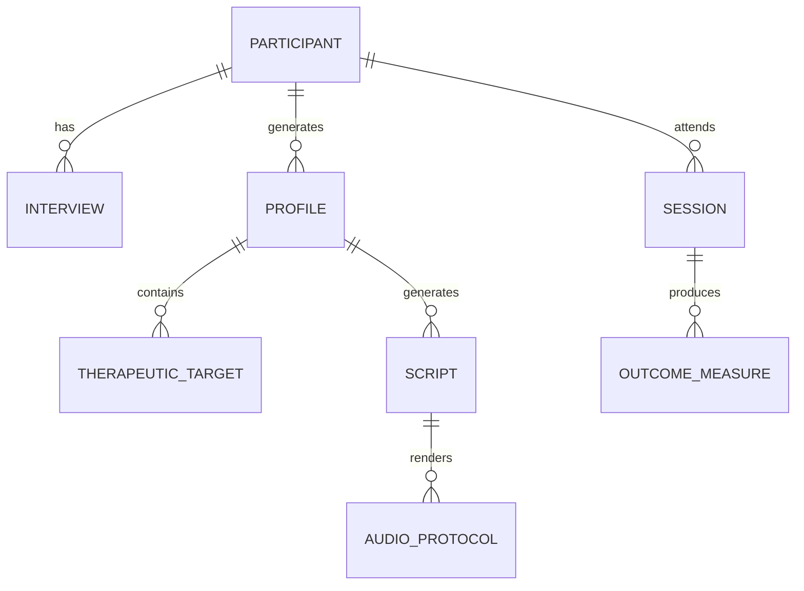

# Data Model Overview

## Core entities

```mermaid
erDiagram
    PARTICIPANT ||--o{ INTERVIEW : has
    PARTICIPANT ||--o{ PROFILE : generates
    PROFILE ||--o{ THERAPEUTIC_TARGET : contains
    PROFILE ||--o{ SCRIPT : generates
    SCRIPT ||--o{ AUDIO_PROTOCOL : renders
    SESSION ||--o{ OUTCOME_MEASURE : produces
    PARTICIPANT ||--o{ SESSION : attends
```

## Data principles

- privacy by design;
- explicit consent;
- local-first where possible;
- delete/export rights;
- separate identity from research data.
